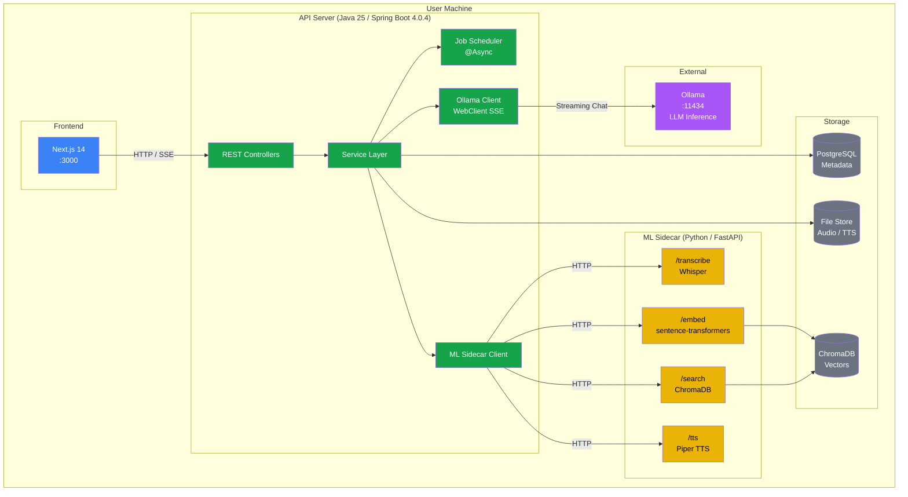
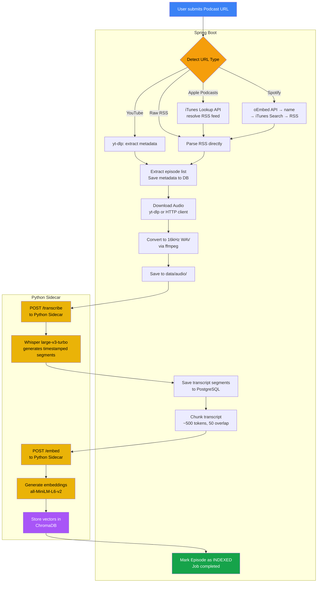
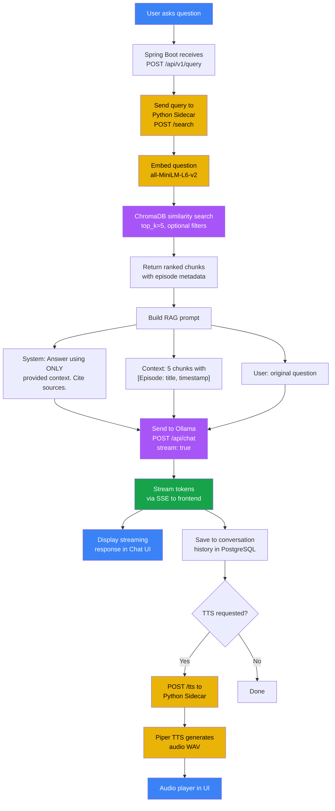
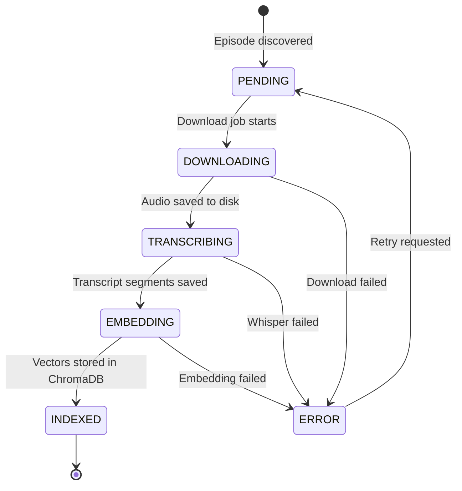
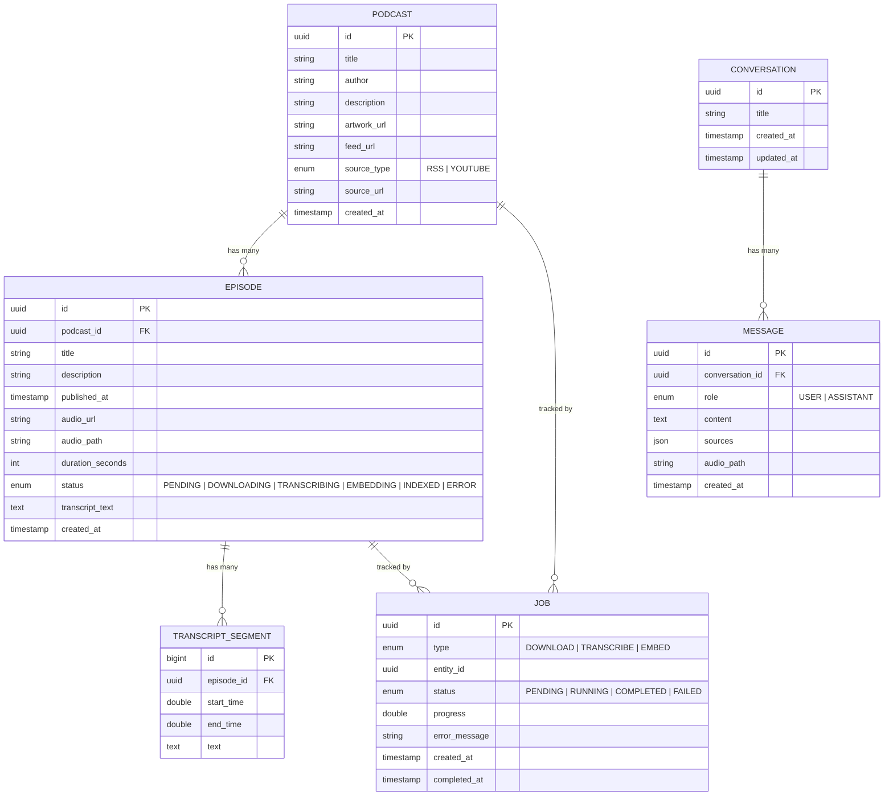
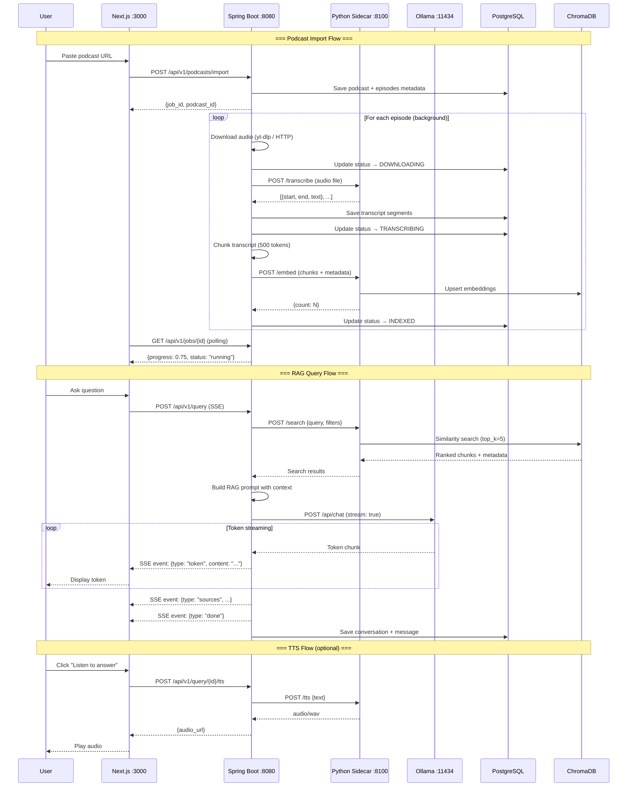

# LocalLoom — Architecture & Flow Diagrams

## 1. System Architecture

---

## 2. Podcast Import Pipeline

---

## 3. RAG Query Pipeline

---

## 4. Episode Status Lifecycle

---

## 5. Entity Relationship Diagram

---

## 6. Service Communication Overview

---

## 7. Tech Stack Layer Diagram

```mermaid
graph LR
    subgraph Presentation
        NextJS[Next.js 14]
        Tailwind[Tailwind CSS]
        ShadcnUI[shadcn/ui]
        TanStack[TanStack Query v5]
    end

    subgraph API_Layer["API Layer (Java 25)"]
        SpringBoot[Spring Boot 4.0.4]
        JPA[Spring Data JPA]
        Flyway[Flyway Migrations]
        Log4j2[Log4j2 2.25.3]
        WebClient[WebClient SSE]
    end

    subgraph ML_Layer["ML Layer (Python 3.11+)"]
        FastAPI[FastAPI]
        Whisper[faster-whisper]
        SentenceT[sentence-transformers]
        PiperTTS[Piper TTS]
    end

    subgraph Data_Layer["Data Layer"]
        PostgreSQL[(PostgreSQL)]
        ChromaDB[(ChromaDB)]
        FileStore[(File System)]
    end

    subgraph Inference
        Ollama[Ollama + Llama 3.1]
    end

    Presentation --> API_Layer
    API_Layer --> ML_Layer
    API_Layer --> Data_Layer
    API_Layer --> Inference
    ML_Layer --> Data_Layer

    style NextJS fill:#3b82f6,color:#fff
    style SpringBoot fill:#16a34a,color:#fff
    style FastAPI fill:#eab308,color:#000
    style Ollama fill:#a855f7,color:#fff
    style PostgreSQL fill:#336791,color:#fff
    style ChromaDB fill:#ff6b6b,color:#fff
```

---

## Color Legend

| Color | Meaning |
|-------|---------|
| Blue | Frontend / User-facing |
| Green | Java / Spring Boot API |
| Yellow | Python ML Sidecar |
| Purple | LLM / Vector inference |
| Gray | Storage / Persistence |
