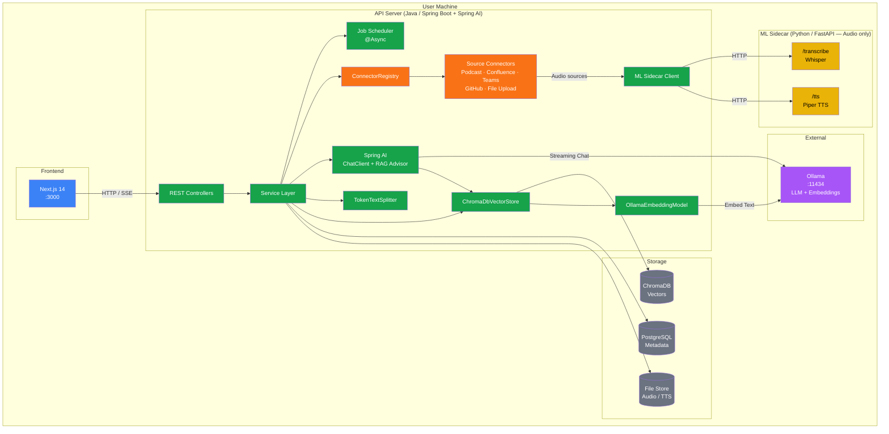
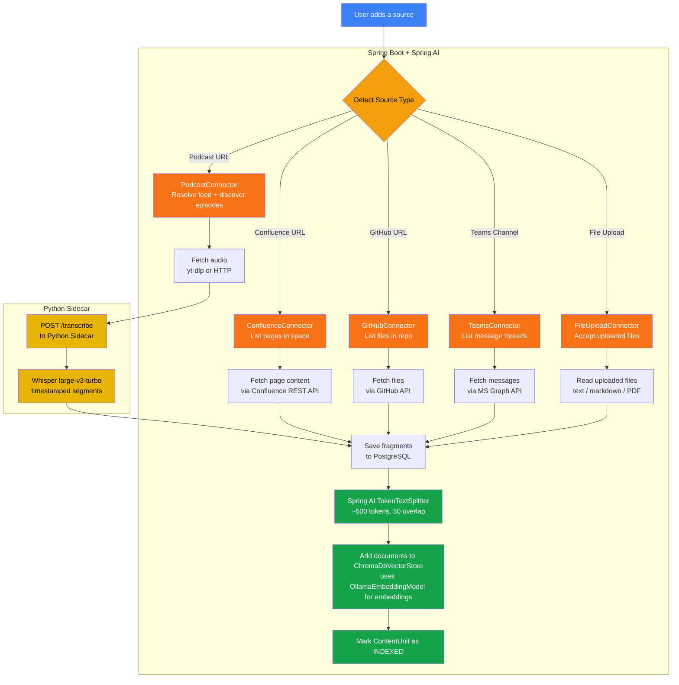
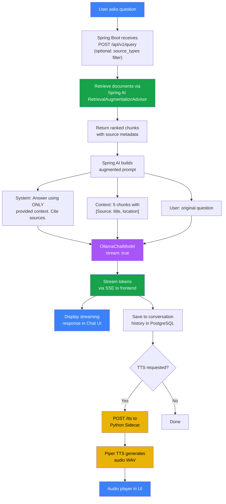
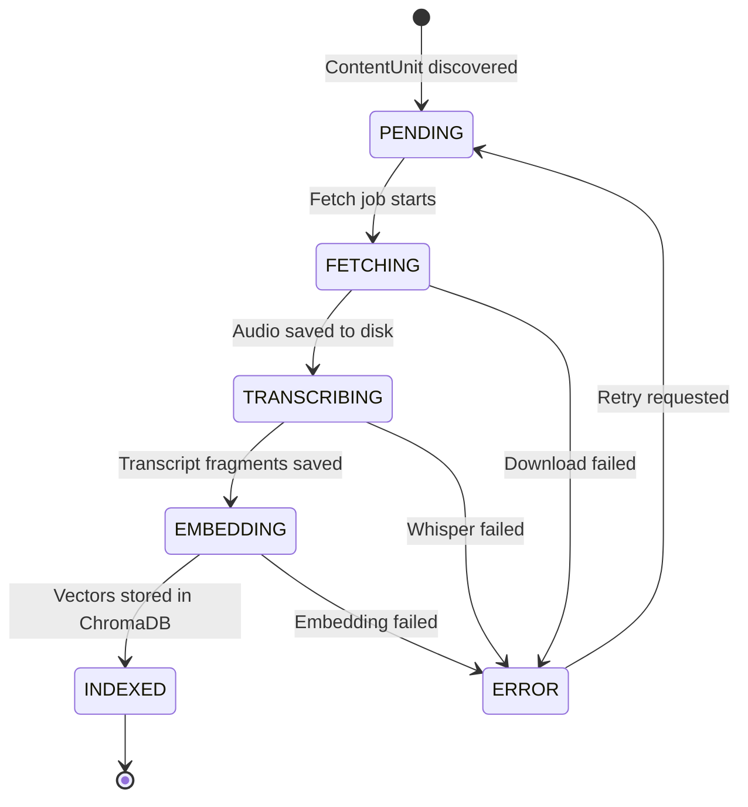
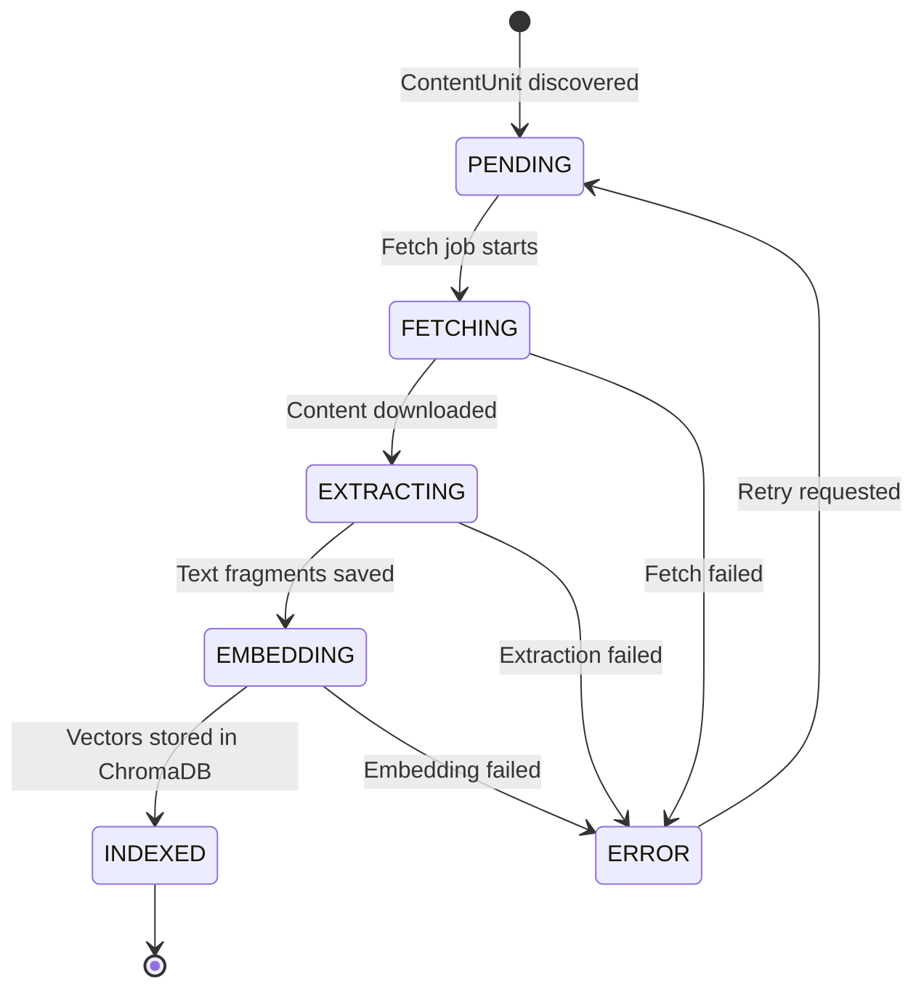
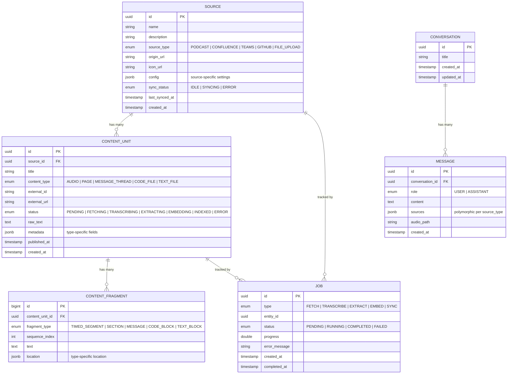
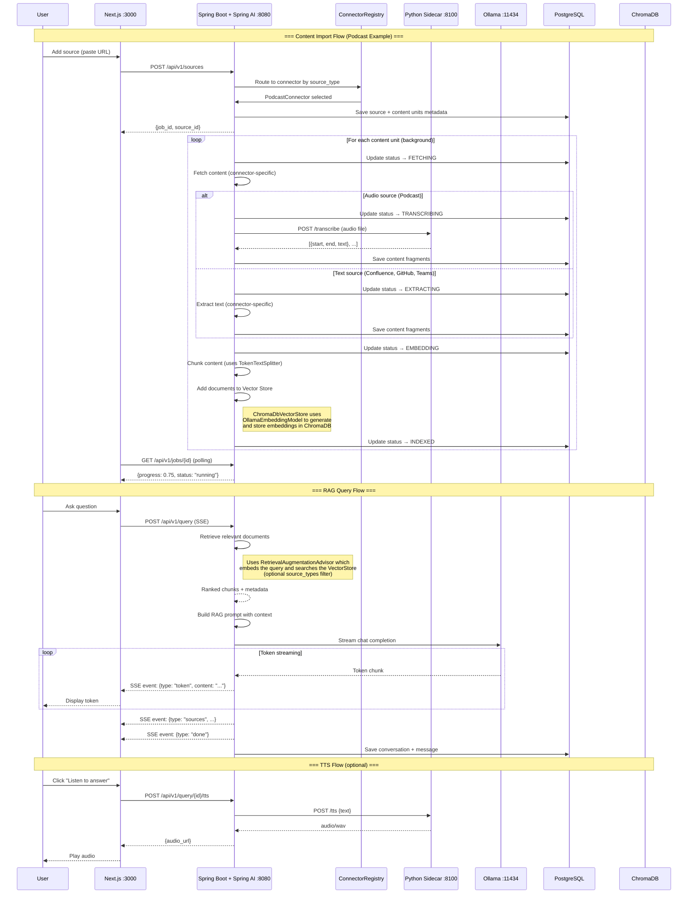

# LocalLoom — Architecture & Flow Diagrams

## 1. System Architecture

> **Note:** Spring Boot and Java versions shown are target versions for this project. Adjust to the latest stable release at implementation time.

---

## 2. Content Ingestion Pipeline

---

## 3. RAG Query Pipeline

---

## 4. ContentUnit Status Lifecycle

### Audio Content (Podcasts)

### Text Content (Confluence, GitHub, Teams)

> **Note:** File uploads skip the FETCHING state since content is already local.
> Upload lifecycle: PENDING → EXTRACTING → EMBEDDING → INDEXED

---

## 5. Entity Relationship Diagram

---

## 6. Service Communication Overview

---

## 7. Tech Stack Layer Diagram

```mermaid
graph LR
    subgraph Presentation
        NextJS[Next.js 14]
        Tailwind[Tailwind CSS]
        ShadcnUI[shadcn/ui]
        TanStack[TanStack Query v5]
    end

    subgraph API_Layer["API Layer (Java 25)"]
        SpringBoot[Spring Boot 4.0]
        SpringAI[Spring AI]
        ConnRegistry[ConnectorRegistry]
        JPA[Spring Data JPA]
        Flyway[Flyway Migrations]
        Log4j2[Log4j2 2.25.3]
    end

    subgraph Connectors["Source Connectors"]
        PodcastConn[Podcast]
        ConfluenceConn[Confluence]
        TeamsConn[MS Teams]
        GitHubConn[GitHub]
        FileConn[File Upload]
    end

    subgraph ML_Layer["ML Layer (Python 3.11+)"]
        FastAPI[FastAPI]
        Whisper[faster-whisper]
        PiperTTS[Piper TTS]
    end

    subgraph Data_Layer["Data Layer"]
        PostgreSQL[(PostgreSQL)]
        ChromaDB[(ChromaDB)]
        FileStore[(File System)]
    end

    subgraph Inference
        Ollama[Ollama + Llama 3.1]
    end

    Presentation --> API_Layer
    API_Layer --> Connectors
    API_Layer --> ML_Layer
    API_Layer --> Data_Layer
    API_Layer --> Inference
    Connectors -->|Audio sources| ML_Layer
    ML_Layer --> Data_Layer

    style NextJS fill:#3b82f6,color:#fff
    style SpringBoot fill:#16a34a,color:#fff
    style ConnRegistry fill:#f97316,color:#fff
    style PodcastConn fill:#f97316,color:#fff
    style ConfluenceConn fill:#f97316,color:#fff
    style TeamsConn fill:#f97316,color:#fff
    style GitHubConn fill:#f97316,color:#fff
    style FileConn fill:#f97316,color:#fff
    style FastAPI fill:#eab308,color:#000
    style Ollama fill:#a855f7,color:#fff
    style PostgreSQL fill:#336791,color:#fff
    style ChromaDB fill:#ff6b6b,color:#fff
```

---

## Color Legend

| Color | Meaning |
|-------|---------|
| Blue | Frontend / User-facing |
| Green | Java / Spring Boot API |
| Orange | Source Connectors |
| Yellow | Python ML Sidecar (audio only) |
| Purple | LLM / Vector inference |
| Gray | Storage / Persistence |
